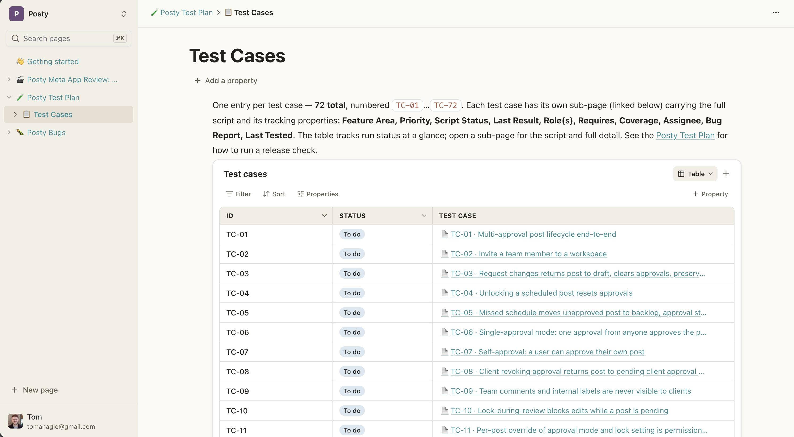

# Potion

A realtime, self-hostable **team collaboration tool** built on Cloudflare
Workers, D1, R2, and Durable Objects — with [TanStack Start](https://tanstack.com/start),
[better-auth](https://www.better-auth.com), and Drizzle ORM.

It's designed to be **forked and deployed to your own Cloudflare account**. Every
deployment-specific value (account, domain, resource names, OAuth creds) comes from
GitHub Actions variables and secrets, so there's nothing to hardcode.



## Features

- **Pages & blocks** — nested pages with headings, to-dos, quotes, callouts,
  dividers, and type-anywhere editing. Markdown rendering throughout.
- **Databases** — typed properties (text, number, select, multi-select, status,
  date, person, checkbox, URL, and more) with table, board, list, gallery, and
  calendar views, plus per-view filters, sorts, and grouping.
- **Shared properties** — page properties live in a workspace-wide catalog, so
  pages reuse each other's definitions and select options; manage them all from
  Settings → Properties.
- **People** — the person property tags one or more workspace members, with
  profile pictures stored in R2.
- **Realtime** — every page has a Durable Object fanning out edits over
  WebSockets: open tabs stay in sync and the header shows who else is viewing.
- **Workspaces** — multiple workspaces per user with invitations, member
  management, and role-based access, backed by better-auth organizations.
- **MCP server** — agents connect at `/mcp` (OAuth) and get tools to search,
  read, and write pages, databases, and properties.

## Deploy your own

Setup is one script. From your fork:

```bash
bun install
bash scripts/setup.sh
```

> Using Claude Code? Run the **`/deploy-setup`** skill instead — it walks you
> through the manual dashboard steps below, then runs the script for you.

### What you'll need

The script asks you a series of questions and provisions everything from your
answers. Have these ready before you start:

- **A Cloudflare account with a domain on it** (in a zone you control) — the app is
  served from that domain.
- **The [GitHub CLI](https://cli.github.com) logged in** (`gh auth login`).
- **A Cloudflare API token** — [create a Custom token](https://dash.cloudflare.com/profile/api-tokens)
  with, for the target account **and** the domain's zone:
  - Account · Workers Scripts · Edit
  - Account · D1 · Edit
  - Account · Workers R2 Storage · Edit
  - Zone · Workers Routes · Edit
  - Zone · DNS · Edit
- **R2 S3 API keys** — Dashboard → R2 → _Manage R2 API Tokens_ → create a token
  with **Object Read & Write** (used for the Pulumi state backend).
- _(optional)_ **Google / GitHub OAuth apps** for social login — set the redirect
  URI to `https://<your-domain>/api/auth/callback/{google,github}`.

The script prompts you for your domain and for pasting in these credentials, then
generates and provisions the rest.

### What the script does

- Generates the stable secrets (`BETTER_AUTH_SECRET`, `PULUMI_CONFIG_PASSPHRASE`).
- Creates the Pulumi **state** R2 bucket — the one resource Pulumi can't create,
  because it's Pulumi's own backend.
- Pushes every variable and secret to your repo with `gh`.

Everything else — the D1 database, assets bucket, Worker, Durable Object, and
custom domain — is created by **Pulumi** on your first deploy.

### Deploy

Push to `main` (or `gh workflow run deploy.yml`). The GitHub Actions pipeline runs
the D1 migrations and `pulumi up`, deploying to `https://<your-domain>`.

> The deploy pipeline lives in `.github/workflows/deploy.yml` + the Pulumi program
> (`infra/index.ts`). `scripts/setup.sh` only prepares your secrets — deployment
> runs once that pipeline is in the repo.

### Configuration reference

The script sets these for you; you can also manage them by hand in
**Settings → Secrets and variables → Actions**.

**Variables** (non-sensitive)

| Name                                    | Required?                       | Notes                                        |
| --------------------------------------- | ------------------------------- | -------------------------------------------- |
| `CLOUDFLARE_ACCOUNT_ID`                 | **yes**                         | Target Cloudflare account                    |
| `APP_DOMAIN`                            | **yes**                         | e.g. `potion.posty.social`                   |
| `WORKER_NAME`                           | default `potion`                | Worker/service name                          |
| `D1_DATABASE_NAME`                      | default `<worker>-db`           | Created by Pulumi                            |
| `R2_BUCKET_NAME`                        | default `<worker>-assets`       | Created by Pulumi                            |
| `PULUMI_STATE_BUCKET`                   | default `<worker>-pulumi-state` | Created by the script                        |
| `CLOUDFLARE_ZONE_ID`                    | optional                        | Derived from `APP_DOMAIN` if omitted         |
| `ZERO_TRUST_EMAILS`                     | optional                        | Locks the app behind Cloudflare Access       |
| `FROM_EMAIL_ADDRESS`                    | optional                        | Email sender; default `noreply@<APP_DOMAIN>` |
| `GOOGLE_CLIENT_ID` / `GITHUB_CLIENT_ID` | optional                        | Enables that provider                        |

**Secrets** (sensitive)

| Name                                            | Required? | Where to get it                                                                                                       |
| ----------------------------------------------- | --------- | --------------------------------------------------------------------------------------------------------------------- |
| `CLOUDFLARE_API_TOKEN`                          | **yes**   | Dashboard → API Tokens                                                                                                |
| `R2_ACCESS_KEY_ID` / `R2_SECRET_ACCESS_KEY`     | **yes**   | R2 → Manage R2 API Tokens                                                                                             |
| `BETTER_AUTH_SECRET`                            | **yes**   | Generated by the script                                                                                               |
| `PULUMI_CONFIG_PASSPHRASE`                      | **yes**   | Generated by the script                                                                                               |
| `GOOGLE_CLIENT_SECRET` / `GITHUB_CLIENT_SECRET` | optional  | OAuth consoles                                                                                                        |
| `RESEND_API_KEY`                                | optional  | [Resend](https://resend.com) — preferred email provider; without it, emails fall back to the Cloudflare Email binding |

## Local development

```bash
bun install
echo "BETTER_AUTH_SECRET=$(npx -y @better-auth/cli@latest secret)" >> .dev.vars
bun run db:migrate   # apply D1 migrations locally
bun run dev          # http://localhost:3001
```

Local D1/R2/Durable Object bindings come from `wrangler.jsonc` via the Cloudflare
Vite plugin; after changing them, regenerate types with `bun run cf-typegen`.

Build a production bundle with `bun run build`.

## Architecture

- **`src/routes/`** — file-based [TanStack Router](https://tanstack.com/router)
  routes. `/p/$pageSlug` is a page, `/settings/*` are the account and workspace
  settings, `/mcp` is the MCP endpoint, and `src/routes/api/` holds server routes
  (realtime WebSocket upgrade, avatars).
- **`src/lib/workspace/`** — the domain layer. `WorkspaceRepository` scopes every
  query to the active workspace; server functions in `functions.ts` expose it to
  the client along with TanStack Query `queryOptions` factories.
- **`src/lib/realtime/`** — the `PageDoc` Durable Object (one per page): fans out
  `doc:update` events after writes and tracks viewer presence over WebSockets.
- **`src/lib/mcp/`** — the MCP tool definitions and JSON-RPC handler.
- **`src/lib/auth.ts`** — better-auth with the Drizzle adapter over D1, the
  organization plugin (workspaces), and optional Google/GitHub OAuth. Regenerate
  the auth tables with `npx -y @better-auth/cli@latest generate`.
- **`infra/index.ts`** — the Pulumi program that provisions Cloudflare resources.

Conventions (data fetching, routing, Drizzle usage) live in [`CLAUDE.md`](./CLAUDE.md).

## MCP

The app exposes an MCP server at `https://<your-domain>/mcp` (streamable HTTP,
OAuth). Connect it to Claude Code with:

```bash
claude mcp add --transport http potion https://<your-domain>/mcp
```

Agents get tools to list workspaces, search and read pages, manage blocks,
database rows, and shared page properties.

## Testing

Tests run with [Vitest](https://vitest.dev/):

```bash
bun run test
```

## Styling

[Tailwind CSS v4](https://tailwindcss.com/) with [shadcn/ui](https://ui.shadcn.com/)
components. Add new components with:

```bash
bunx shadcn@latest add button
```
